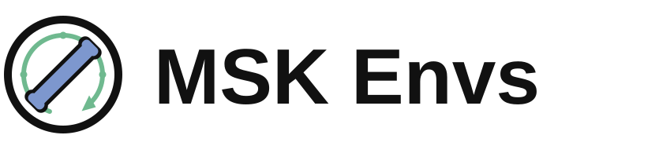
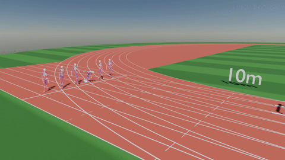
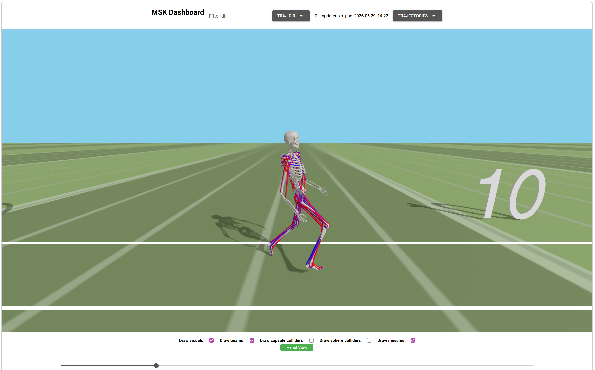

<h2>
<br>RL Environments for Musculoskeletal Simulations
</h2>

RL environments built on top of the [Bolt](https://github.com/willwng/bolt) simulator that run entirely on the GPU.

<div float="center">
  
</div>

## Preqrequisites/Setup
Requires installation of [Bolt](https://github.com/willwng/bolt) (instructions can be found in the README).

Rest of packages (required for training and visualization):
```bash
cd "path to msk_envs"
pip install -r requirements.txt
```

## Training
We provide example training code based on [FastTD3](https://github.com/younggyoseo/FastTD3), [QFlex](https://github.com/LNSGroup/Qflex), SAC, and PPO (see [Holosoma](https://github.com/amazon-far/holosoma/tree/main)), including hyperparameters for the example environments.

To start a training run, use the corresponding config (found in [hyperparams](msk_envs/train/hyperparams.py)):

```bash
python -m msk_envs.train.train [sprint|vertical|...] --exp_prefix my_training_run --algo td3 env_config:sprinter
```

*Note that `env-config.*` parameters must be set at the end*

## Trajectory visualization
We provide visualization tools as well as scripts to generate analytics of trajectories (as PDFs).
### Dashboard (web-viewer)
<div float="center">
  
</div>

During training, every `eval_freq` steps, the training script will save a 
checkpoint and a trajectory JSON. This trajectory can be visualized with 
the web-viewer.
```bash
cd dashboard
python3 dashboard.py
```

#### Visualize from remote

First, mount the remote traj dir to your local machine

```bash
sshfs remote_dir ./dashboard/remote_trajectories
```

Then run the dashboard pointing to it
```bash
cd dashboard
python dashboard.py --traj-dir remote_trajectories
```

### Blender
We include scripts for importing trajectories as Blender animations
```bash
cd blender
blender render_render.py
```
*Note: the paths at the top of the file will need to be updated*

Run the script in Blender (may take several minutes to load the trajectory). 
The script will create a new scene with the animation.
